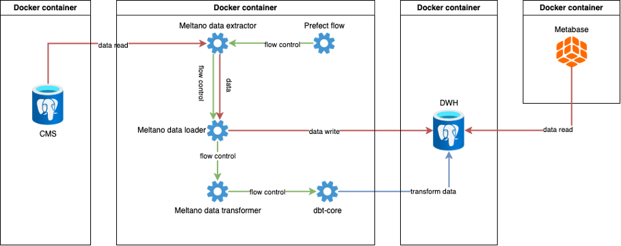
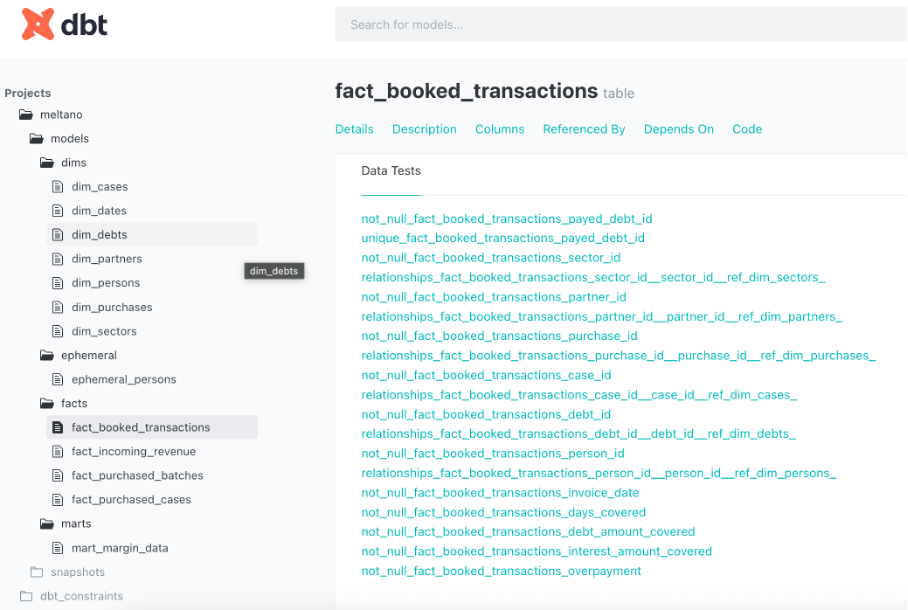
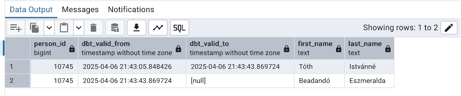
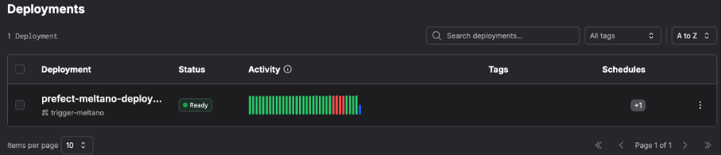
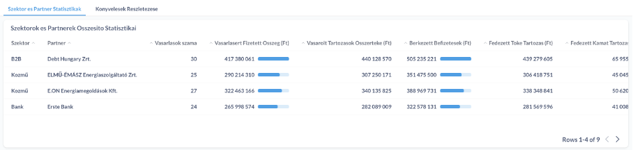
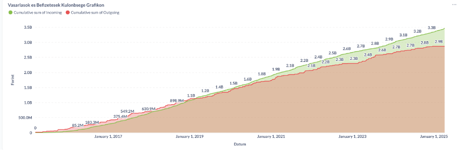
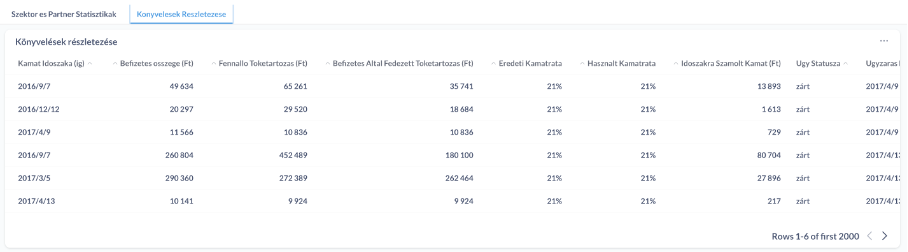
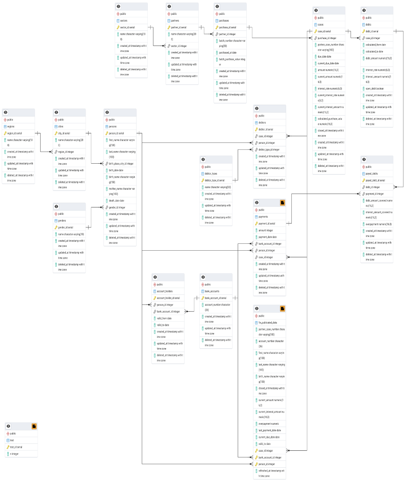
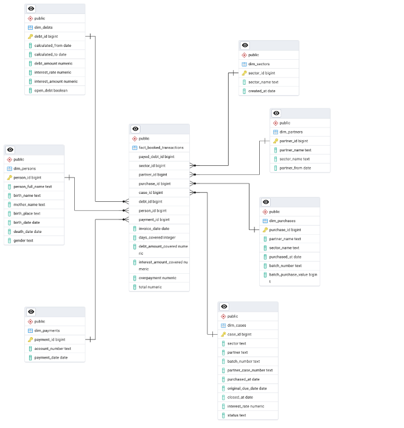
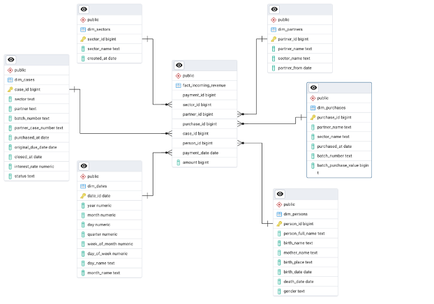

**Haladó adattárház terchnológiák** Tóth István (J0P7MF) 2025.04.06

# Lakossági adósságkezelő rendszerhez adattárház data-pipeline megvalósítása

## Feladat leírása
A feladatban a haladó adatbázis kezelő rendszerek beadandóban elkészített adósságkezelő rendszerhez valósítottam meg egy adattárház data pipeline-t. A mintául szolgáló rendszer több száz táblát, sok terrabájtnyi adatot, több tízezer sornyi tárolt eljárást tartalmaz és legalább 8 különböző alkalmazással van kapcsolata, ezért az egyszerűsítés elkerülhetetlen volt. Az eredeti rendszer tábláiból csak azokat valósítottam meg amelyeken keresztül egy egyszerűsített folyamat bemutatható és azokat is a szükséges minimális oszlop tartalommal. A cégtitkok megőrzése érdekében az eredeti rendszer tábla és oszlopnevei meg lettek változtatva és más adatbázis kezelő rendszert használtam, hogy semmilyen átjárhatóság ne legyen a kettő rendszer között.

A megvalósított folyamat része az adatok kinyerése a tranzakcionális rendszerből, betöltése az adattárházba, a szükséges transzformációk elvégzése. Az előállított transzformált adatokhoz BI eszközzel különböző kimutatásokat valósítottam meg.

## Alkalmazott technológiák
Az adatbázis kezelő rendszer a PostgreSQL(1) úgy a tranzakcionális rendszerben, mint az adattárházban. A kettő közötti adatmozgatást a Meltano(2) valósítja meg. Az adatok transzformációjához dbt-core(3)-t használtam. Az áttöltések és a transzformáció ütemezése és koordinálására a Prefect(4)-et használtam. Az adattárház adataiból a kimutatásokat a Metabase(5) BI eszközzel készítettem el. A teljes infrastruktúra Docker(6) konténerekben fut. A Prefect-hez szükséges kódokhoz a Python(7) programozási nyelvet használtam.

## A rendszer architektúrája

A forrás adatbázisról az adatokat a Meltano segítségével mozgatom cél adatbázisba (mindkettő Dockerben futó PostgreSQL). Ehhez a Meltano Postgre extractor és loader adatptereit használtam. Az extractor a forrás adatbázisban létrehozott publikációt olvassa, amely publikációban a mozgatandó táblák szerepelnek. Az extractor a számára létrehozott replikáció slot-on keresztül olvassa a WAL logokat. Ehhez szükséges volt, hogy a WAL logok elegendő ideig legyenek megőrizve. Ezt a Postgres konfigurációjával biztosítottam. A WAL logok változtatásait az extractor átadja a loadernek, majd az alkalmazza a DWH staging sémájában lévő táblákon és adatokon. A Meltano ezek után meghívja a felkonfigurált transformert, amely egy dbt-core project és feladata elvégezni a szükséges transzformációkat (létrehozza a dimenzió és tény táblákat a public sémában). A felhasználó számára egy Metabasen keresztül elérhető felület jeleníti meg az adatokat, ahol lehetőség van self service kimutatások készítésre, de természetesen előre konfiguráltam egy Dashbordot a fontosabb adatokkal. Az így létrehozott ELT folyamat ütemezéséért egy Prefect flow a felelős.

## Extract és load funkcionalitás
A feladatban az Extract-Load-Transform folyamat lett megvalósítva, amelyből az extract és a load a Meltano-val készült el. A Meltano kifejezetten EL folyamatokra kifejlesztett eszköz, de integrálható bele transzformációs és egyéb plugin-ek is. Az EL folyamathoz szükség volt a tap-postgres és a target-postgres eszközök megfelelő konfigurációjára, amely yaml fájlokon keresztül lehetséges. A log_based replication method-ot használtam, amihez a forrás adatbázisban publikációt és a Meltano számára dedikált replication slot-ot hoztam létre, ehhez felkonfiguráltam a mozgatandó táblákat és adatbázis eléréseket. A load method upsert, ami azt jelenti, hogy csak a változott vagy új adatok kerülnek áttöltésre (a töröltek pedig csak logikailag törlődnek). A felkonfigurált folyamat automatikusan hozzáadja minden táblához az _sdc_lsn mezőt, ami a WAL log azonosítója, ez alapján tudja a loader, hogy mely rekordot kell módosítani.

## Transform funkcionalitás
Az adatok a dwh adatbázis staging sémájába kerülnek át az EL folyamat során, ezek után történik meg a transzformáció, melynek eredménye a public sémába kerül. A transzformáció a staging adatokat csillag sémára alakítja át, dimenzió és tény táblákat létrehozva. Ehhez egy dbt-core projekt lett felkonfigurálva, amely projektet a Meltano indít el az EL folyamat végén. A dbt-ben Jinja template SQL szkriptek formájában vannak definiálva az átalakítások, ezeket a dbt modelleknek nevezi. Ezen modellek megfelelő konfigurálásával lettek létrehozva az adat tesztek, az indexek és a primary és foreign key-ek, amelyek fontosak a prezentációs rétegben a BI eszköz számára, hogy a kapcsolatokat automatikusan felismerje. A dbt egyik előnye, hogy megfelelő modell definíciók alapján képes dokumentációt gyártani, amely egy webes felületen interaktív módon megtekinthető. Egy másik fontos tulajdonsága, hogy a modellekhez teszteket is definiálhatunk, így az áttöltések során már biztosíthatjuk, hogy csak konzisztens adatok töltődjenek át. A létrehozott projektben a dbt mintegy 100 tesztet és műveletet végez az adatbázisban.

 
## Slowly changing dimensions
A feladatban a tranzakciós rendszerben nyilvántartott adósok adatainak változásait a dbt snapshot funkciójával valósítottam meg. Ez a funkció egy definiált modell alapján képes létrehozni snapshot táblákat, amelyben a rekordok korábbi verziói elérhetőek és ahol tól-ig dátumokkal jelöli az egyes rekordok érvényességét.

 
## Orchestration
Bár a Meltano alkalmas arra, hogy definiáljunk benne egy EL vagy ELT folyamatot, azok ütemezésére nem képes. Erre a feladatra a Prefect-et használtam, amiben Python kódként definiáltam egy flow-t, ami feladata csupán annyi, hogy ütemezetten elindítsa a Meltano projektet. Ennek felügyeletére a Prefect egy webes felületet is biztosít, ahol minden futás logja megtekinthető és ahol nyomon lehet követni az ütemezéseket, a sikeres, sikertelen futásokat.

 
## Prezentációs réteg
A dwh-ban előállt adatok alapján azok megtekintésére a Metabase által biztosított felületen van lehetőség. Itt nem self service módon lehet saját kimutatásokat készíteni. A feladat elkészítése során előre definiáltam több grafikon, táblázatot, pivot táblát.

 

## A használt forrás adatbázis modell

## A használt dwh adatbázis modell
(minták)

## Hivatkozások
(1) PostgreSQL: https://www.postgresql.org/

(2) Meltano: https://meltano.com/

(3) dbt-core: https://docs.getdbt.com/docs/introduction

(4) Prefect: https://www.prefect.io/

(5) Metabase: https://www.metabase.com/

(6) Docker: https://www.docker.com/

(7) Python: https://www.python.org/
